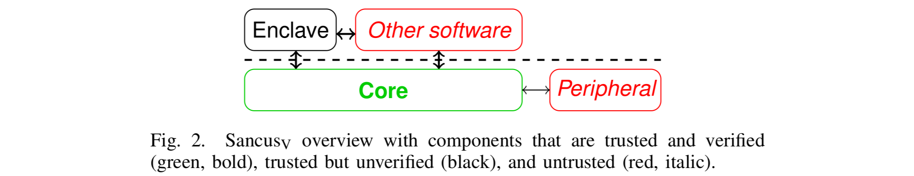
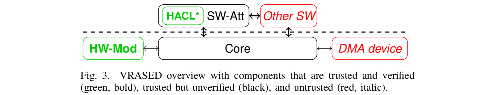

# Mind the Gap: Studying the Insecurity of Provably Secure Embedded Trusted Execution Architectures

This repository is the hub for the code accompanying our [paper]() "Mind the
Gap: Studying the Insecurity of Provably Secure Embedded Trusted Execution
Architectures" to appear at the IEEE Symposium on Security and Privacy 2022.

> M. Bognar, J. Van Bulck, and F. Piessens, "Mind the Gap: Studying the Insecurity of Provably Secure Embedded Trusted Execution Architectures," in 2022 IEEE Symposium on Security and Privacy (S&P).

As our case study includes several provably secure embedded security
architectures, the accompanying source code is logically split across several
repositories, linked below.
Specifically, for every security architecture we studied, we forked the
original open-source project in a separate repository, which allows to
implement our proof-of-concept attacks on top of the original commit history.

**:heavy_check_mark: Continuous integration.** 
We added continuous integration for every project to provide a
fully reproducible build environment and reference output for all our attack
experiments, executed via a cycle-accurate
[`iverilog`](http://iverilog.icarus.com/) simulation of the systems' respective
[openMSP430](https://github.com/olgirard/openmsp430/)-based designs.

**:no_entry_sign: Mitigations.**
Finally, when applicable, we provide simple patches for the identified
implementation flaws in a separate mitigations branch of the respective project.
Note, however, that these patches merely fix the identified vulnerabilities in
the respective reference implementations in an _ad-hoc_ manner.
Specifically, our patches do not address the root cause for these oversights
(i.e., in terms of preventing implementation-model mismatches, missing attacker
capabilities, deductive errors) and cannot in any other way guarantee the
absence of further vulnerabilities.
We provide more discussion on mitigations and guidelines in the paper.

## Sancus_V: Provably secure interruptible enclaves 

Our attack source code, continuous integration, and reference output are
provided in a separate
[sancus-core-gap](https://github.com/martonbognar/sancus-core-gap) repository.

The original Sancus_V provably secure interruptible enclave processor is
described in the following [paper](https://jovanbulck.github.io/files/csf20-irq.pdf).

> M. Busi, J. Noorman, J. Van Bulck, L. Galletta, P. Degano, J. T. Mühlberg and F. Piessens, "Provably secure isolation for interruptible
enclaved execution on small microprocessors," in 33rd IEEE Computer Security Foundations Symposium (CSF), Jun. 2020, pp. 262–276.

## VRASED: Verifiable remote attestation 

Our attack source code, continuous integration, and reference output are
provided in a separate
[vrased-gap](https://github.com/martonbognar/vrased-gap) repository.
Furthermore, the [apex-gap](https://github.com/martonbognar/apex-gap)
repository contains the attack on the VRASED secure peripheral extension in the
derived APEX security architecture.

The original VRASED verifiable remote attestation hardware-software co-design,
is described in the following [paper](https://www.usenix.org/system/files/sec19-nunes.pdf).

> I. D. O. Nunes, K. Eldefrawy, N. Rattanavipanon, M. Steiner, and G. Tsudik, "VRASED: A verified hardware/software co-design for remote attestation," in 28th USENIX Security Symposium, 2019, pp. 1429–1446.

**:warning: VRASED derivatives.**
Multiple derived architectures have been published that are
directly derived from the open-source VRASED research prototype and
use its security arguments as the basis of their own.
At the time of writing, open-source VRASED-based security architectures include
[RATA (CCS'21)](https://github.com/sprout-uci/RATA),
[APEX (USENIX'20)](https://github.com/sprout-uci/APEX), and
[PURE (ICCAD'19)](https://github.com/sprout-uci/vrased/tree/pure).
While we only validated the attacks in this repository on the original VRASED
base architecture, they may similarly affect these derived architectures.

## Paper abstract

The security claims of a system can be supported or refuted by different kinds
of evidence.
On the one hand, *attack research* uses empirical, experimental, inductive
methods to refute security claims. If motivated and competent
attackers do not succeed in breaking a specific security property, this
provides some support (but no definite proof) that the system is secure.

On the other hand, *formal methods* use mathematical, deductive methods
that can prove the security of a *model* of the system. The process of
constructing a proof can uncover vulnerabilities that can then be
fixed. The use of formal methods can be very powerful and is attractive
because it seems to provide irrefutable evidence of security. However, that
evidence applies only to the mathematical model, not to any actual system, and,
hence, it is important to understand the gap between the model and the
real-world system.

In this paper, we present a case study that examines this gap for two
embedded security architectures that use formal methods to prove their
security properties. Despite strong formal evidence for security, we discover
numerous attacks against the implementations, all of which falsify proven
security properties. These attacks range from exploiting simple programming
errors to a novel DMA-based side-channel attack.
The simple attacks demonstrate that the construction of systems and proofs is
error-prone, while some of the more sophisticated attacks serve as examples to
show that formal methods alone can never guarantee the security of a
real-world system.

From our case study, we also distill actionable guidelines on how to
provide stronger evidence for the security of a system.
